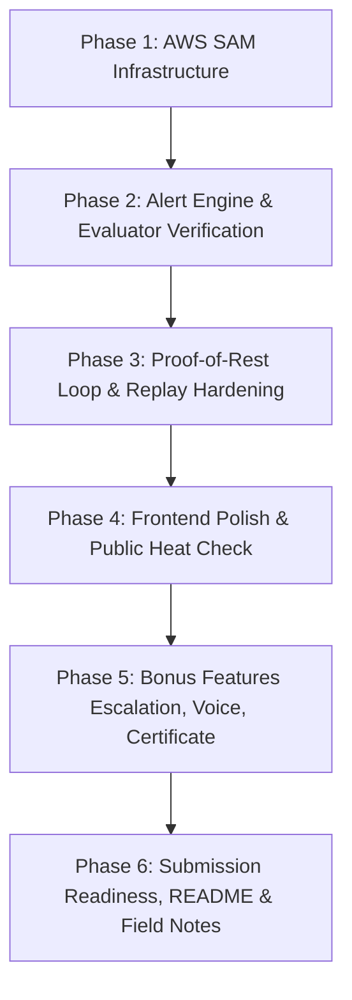

# ShiftShield: Gufran's Implementation Plan
**Role**: Cloud and Product ("Everything that runs or is seen")  
**Team**: EcoNexus (Track 02: Heat and Water, Environmental Hacks 2026)  
**Primary Reference**: [`docs/ShiftShield_Work_Split_Sameer_Gufran.pdf`](ShiftShield_Work_Split_Sameer_Gufran.pdf) & [`docs/ShiftShield_Final_Plan_v7.pdf`](ShiftShield_Final_Plan_v7.pdf)

---

## 1. Executive Summary & Ownership Boundary

As defined in the official team work split agreement:
- **Sameer owns**: The Engine, rulebook agent, physical calculations (WBGT, NIOSH thresholds, Open-Meteo fetch), replay data generation, and documentation/video.
- **Gufran owns**: **Everything that runs or is seen** — AWS architecture and SAM deployment (`infra/`), DynamoDB tables, 15-minute scheduled evaluator, alert trigger & deduplication logic, SNS email delivery, API routes, the supervisor dashboard, anonymous worker QR rest page, four-state proof-of-rest loop, self-playing demo link, and submission checklist.

```
┌─────────────────────────────────────────────────────────────────────────────┐
│                             SHIFTSHIELD ARCHITECTURE                        │
├────────────────────────────────────────┬────────────────────────────────────┤
│ SAMEER (Engine & Calculation)          │ GUFRAN (Cloud & Product)           │
│ • Open-Meteo forecast fetch            │ • AWS SAM Cloud Infrastructure     │
│ • Liljegren physical WBGT (pywbgt)     │ • DynamoDB tables & TTL keys       │
│ • NIOSH deterministic schedule (v1)    │ • 15-minute EventBridge evaluator  │
│ • Bedrock rulebook candidate extractor │ • Alert deduplication & SNS email  │
│ • Real-day Hyderabad replay fixtures   │ • Signed supervisor ack tokens     │
│ • Evaluation scoring against HAPs      │ • Anonymous worker QR & Rest loop  │
│                                        │ • Supervisor Dashboard & Approval  │
│                                        │ • Public Heat Check & Demo link    │
└────────────────────────────────────────┴────────────────────────────────────┘
```

---

## 2. Current Repository Audit vs. Gufran's Deliverables

| Deliverable | Required by Work Split | Current State in Repo | Action Needed |
|---|---|---|---|
| **AWS SAM Template** | One-command deploy of Lambdas, DynamoDB, HTTP API, EventBridge, SNS | ❌ **Missing**: No `template.yaml` exists in the repository | Create `template.yaml` defining all 9 tables, 2 Lambdas, HTTP API, EventBridge schedule, SNS topic, and IAM policies |
| **DynamoDB Tables** | 9 tables (`sites`, `site_state`, `alert_keys`, `issue_log`, `acks`, `rest_confirms`, `rulebooks`, `obligation_log`, `replay_runs`) | ⚠️ Defined in Python (`store.py`), but only backed by local SQLite | Provide CloudFormation/SAM resources for all 9 tables with exact primary/sort keys and TTL |
| **15-Min Scheduled Evaluator** | EventBridge schedule triggering Lambda every 15 min | ⚠️ `backend/app/evaluator.py` exists, but lacks scheduled SAM trigger & CloudWatch DLQ | Wire EventBridge Scheduler rule in SAM with dead-letter queue and alarm |
| **Alert Engine & Deduplication** | 60-min heads-up, <30-min urgent, 30-min cooldown, hysteresis easing, DynamoDB conditional idempotency | ⚠️ `backend/app/alerts.py` code exists | Verify and write unit/integration tests for conditional write idempotency and reminder trigger at 20 min |
| **Signed Acknowledgment** | Single-use signed token expiring at shift end (`/ack/{token}`) | ⚠️ Implemented via HMAC in `alerts.py` and `AckPage.tsx` | Ensure Secrets Manager secret retrieval fallback and end-to-end browser proof |
| **Supervisor Dashboard** | Live heat status, WBGT gauge, transition countdown, "Break Started" tap, candidate rule approval | ✅ Implemented in `DashboardPage.tsx` | Polish mobile responsiveness, connect rule approval mutation to persistent store |
| **Worker QR & Rest Record** | Anonymous break verification (`/rest/{siteCode}`), thumbs-up/down, 4 rest states, aggregate masking (<3) | ✅ Implemented in `RestPage.tsx` & `rest.py` | Verify that break window validation matches live schedule and replay state |
| **Self-Playing Demo (`/demo`)** | Auto-playing hot day replay (<3 min) demonstrating full alert → ack → QR → 4-state rest → ledger loop | ⚠️ Partially working (`ReplayPage.tsx` exists, but needs 1-click auto-advance and state sync to dashboard) | Fix replay state persistence so supervisor tap + worker responses drive the 4-state rest ledger live |
| **Public Heat Check (`/`)** | Zero-login 10-second site heat check with plain guidance | ✅ Working in `HeatCheckPage.tsx` | Ensure Open-Meteo attribution is visible and loading states are silky smooth |
| **Bonus Features** | Escalation chain, Polly voice alert, KMS heat certificate, Shade payback | ❌ Not started (P1 priority) | Implement after core P0 loop passes 2 PM checkpoint |

---

## 3. Detailed Phase-by-Phase Implementation Plan



### Phase 1: AWS SAM Infrastructure & Deployment Blueprint (Day 1 / Thursday)
**Objective**: Deliver the single-command AWS SAM infrastructure template (`template.yaml`) and deployment instructions.

1. **Create `template.yaml`**:
   - **API Gateway**: `AWS::Serverless::HttpApi` with CORS enabled (`AllowOrigins: ['*']`, `AllowMethods: ['GET', 'POST', 'OPTIONS']`, `AllowHeaders: ['Authorization', 'Content-Type']`).
   - **API Lambda**: `AWS::Serverless::Function` pointing to `backend/app/lambda_handler.handler`, Python 3.12 runtime, memory 512 MB, timeout 29s.
   - **Evaluator Lambda**: `AWS::Serverless::Function` pointing to `backend/app/evaluator.handler`, Python 3.12, memory 512 MB, timeout 60s.
   - **EventBridge Schedule**: `AWS::Scheduler::Schedule` triggering `evaluator.handler` on `rate(15 minutes)` with flexible time window off and Dead Letter Queue (`AWS::SQS::Queue`).
   - **DynamoDB Tables** (All `BillingMode: PAY_PER_REQUEST`):
     1. `SitesTable`: PK `site_id` (String)
     2. `SiteStateTable`: PK `site_id` (String), SK `state_key` (String)
     3. `AlertKeysTable`: PK `idempotency_key` (String), TTL attribute `ttl`
     4. `IssueLogTable`: PK `site_id` (String), SK `issue_id` (String)
     5. `AcksTable`: PK `alert_id` (String)
     6. `RestConfirmsTable`: PK `rest_key` (String)
     7. `RulebooksTable`: PK `plan_id` (String), SK `rule_id` (String)
     8. `ObligationLogTable`: PK `site_id` (String), SK `obligation_key` (String)
     9. `ReplayRunsTable`: PK `run_id` (String), SK `event_id` (String)
   - **SNS Alert Topic**: `AWS::SNS::Topic` for supervisor alert emails.
   - **Secrets Manager**: `AWS::SecretsManager::Secret` for `AckSigningSecret`.
   - **IAM Policies**: Least-privilege policies granting Lambda functions read/write access only to their specific tables, SNS publish, SecretsManager read, and Bedrock invoke (`bedrock:InvokeModel`).
2. **Lambda Layer Packaging**:
   - Provide `scripts/build_layer.sh` / Docker command to package `pywbgt`, `metpy`, `pandas`, `numpy`, `scipy` for Amazon Linux 2023 (x86_64 / arm64) so compiled C-extensions load cleanly in Lambda.
3. **Deployment Documentation**:
   - Write `docs/aws-deployment-guide.md` specifying:
     - Target region: `ap-south-1` (Mumbai)
     - `sam build --use-container` and `sam deploy --guided`
     - AWS Budgets setup instructions with a 5 USD / 10 USD alert threshold.

---

### Phase 2: Alert Engine, Idempotency & 15-Minute Evaluator (Day 2 / Friday First Half)
**Objective**: Ensure the 15-minute evaluation loop executes reliably with zero duplicate alerts, signed links, and tamper-resistant logging.

1. **Evaluator Scheduling & Execution**:
   - Validate `backend/app/evaluator.py`: iterates all active sites in `TABLE_SITES`, fetches current forecast, calculates WBGT & band, evaluates transition timing.
2. **Alert Trigger Rules**:
   - **Heads-Up Alert**: Issued 45–75 minutes (target ~60 minutes) before a stricter band begins.
   - **Urgent Alert**: Issued immediately if tighter transition is <30 minutes away.
   - **Cooldown**: 30 minutes for identical band/alert types; stricter transitions immediately bypass cooldown.
   - **Hysteresis (Easing)**: Schedule only relaxes after two consecutive evaluations below the threshold minus conservative buffer.
3. **Idempotency & Conditional Writes**:
   - Key formula: `sha256(siteId + shiftDate + fromBand + toBand + windowStart)`.
   - DynamoDB conditional write (`attribute_not_exists(idempotency_key)`) prevents duplicate alerts if the evaluator retries.
4. **Signed Acknowledgement Tokens**:
   - HMAC-SHA256 token encoding `{site_id, alert_id, exp}` signed by `ACK_SIGNING_SECRET`.
   - Route `/api/ack/{token}` verifies signature and expiry; records one-tap supervisor acknowledgment.
   - 20-minute unacknowledged reminder: Evaluator checks unacknowledged alerts older than 20 min and dispatches a single reminder before stopping.
5. **Issue Log**:
   - Write-only audit trail in `TABLE_ISSUE_LOG` logging timestamp, site ID, from/to band, lead minutes, source versions, and delivery channel.
6. **Automated Tests**:
   - Write `backend/tests/test_alerts_idempotency.py`:
     - Test duplicate prevention on repeated evaluations.
     - Test cooldown bypass when temperature spikes.
     - Test HMAC expiration and signature tampering rejection.
     - Test 20-minute reminder dispatch.

---

### Phase 3: The Proof-of-Rest Loop & Self-Playing Demo Hardening (Day 2 / Friday & Day 3 / Saturday Morning)
**Objective**: Close the loop between supervisor actions and anonymous worker responses to produce the verified 4-state rest record and make `/demo` autonomously runnable.

1. **The Four Rest-Record States**:
   Implement and test the state derivation in `backend/app/rest.py` and display on both the dashboard and replay:
   - 🟢 **Confirmed by both**: Supervisor clicked "BREAK STARTED" AND workers majority answered "WE GOT THE BREAK".
   - 🟡 **Supervisor only**: Supervisor logged the break, but no worker responses were submitted during the window.
   - 🔴 **Disputed**: Supervisor logged the break, but workers majority answered "NO BREAK".
   - ⚪ **No record**: Neither supervisor nor workers logged a break during the scheduled rest window.
2. **Anonymous Worker QR Experience (`/rest/{siteCode}`)**:
   - Accessible without login via mobile QR scan.
   - High-contrast, large touch targets: `WE GOT THE BREAK` vs `NO BREAK`.
   - Optional checklist: Water available? (Yes/No), Shade available? (Yes/No).
   - Symptom reporting: Dizziness, cramps, headache, OK.
   - **Privacy Constraints**:
     - No cookies, no device fingerprints, no IP storage, no phone numbers.
     - Response counts masked until at least 3 workers submit.
     - Symptoms cross threshold -> automatically tighten schedule by one band; **never** relax.
3. **Self-Playing Demo (`/demo` and `/replay`)**:
   - Ensure clicking "Start Demo" or navigating to `/demo` automatically steps through the hot-day scenario (8:00 Normal → 10:00 Caution → 11:30 High → 13:00 Very High) within 2–3 minutes.
   - Ensure the replay simulation updates the actual rest-state indicators and compliance ledger on screen so judges see the full evidence loop.
   - Add clear "DEMO / SYNTHETIC DATA" labels across all replay screens.

---

### Phase 4: Frontend UI/UX Refinement & Rulebook Approval Screen (Day 2 / Friday Second Half)
**Objective**: Polish the supervisor dashboard, rulebook approval interface, and public heat check to meet the highest visual and operational standards.

1. **Supervisor Dashboard (`/dashboard/:siteId`)**:
   - High-contrast industrial editorial theme (deep navy background, ShiftShield safety orange `#F36B3F`, clear status badges).
   - Real-time WBGT gauge showing air temperature vs. estimated site WBGT + conservative margin.
   - Next transition countdown timer (e.g., "HIGH band in 42 minutes").
   - Actionable "BREAK STARTED" button with immediate visual confirmation.
   - Paired evidence indicators: `Supervisor: Acknowledged` / `Workers: 5 Responses (Majority YES)`.
2. **Rulebook Approval Screen (`/rulebooks` or Dashboard tab)**:
   - Display candidate rules extracted by Bedrock from uploaded Heat Action Plans (e.g. Delhi HAP 2025, Telangana HAP 2021).
   - For every candidate rule, clearly show:
     - Rule category (rest window, water, shade, working hours)
     - Condition for application
     - **Exact verbatim quote** from the plan
     - **Exact page number** citation
   - Action buttons: **Approve**, **Edit**, or **Reject**.
   - Approved rules feed into the Daily Compliance Table: `OBLIGATION | PLAN SAYS | PHYSIOLOGY SAYS | APPLIED TODAY | STATUS | CONFIRMED BY`.
3. **Public Heat Check (`/`)**:
   - Accessible in ~10 seconds with zero signup.
   - Location input or geolocation pin.
   - Sliders/toggles for shade, surface, intensity, acclimatisation.
   - Plain language output: "Take a 15-minute break every 45 minutes in shade; drink 1 cup of water every 20 minutes."
   - Timeline chart for the upcoming 12–24 hours.

---

### Phase 5: Bonus Features (Saturday Afternoon - In Strict Priority Order)
*Per Section 6 of the work split: "Take them strictly in this order. One finished bonus feature is worth more than four started."*

1. **Bonus 1: Escalation Chain**:
   - If supervisor does not acknowledge alert within 15 minutes, send reminder.
   - If still unacknowledged after 30 minutes, escalate alert via SNS to the Safety Officer / Contractor.
   - Can be modeled via AWS Step Functions state machine or Lambda timeout evaluator.
2. **Bonus 2: Voice Alert (Amazon Polly)**:
   - Call Amazon Polly to synthesize alert speech in Hindi (Aditi/Kajal) and English (Raveena/Kajal).
   - Return an S3 pre-signed audio link or embedded audio player in the alert notification/SMS.
3. **Bonus 3: Daily Heat-Day Certificate & Verification**:
   - Generate an end-of-shift compliance summary certificate (hours worked, rest breaks prescribed, rest breaks confirmed by workers).
   - Sign certificate hash using AWS KMS key.
   - Add public verification route `/verify/:certificateId` where anyone can verify the cryptographic signature.
4. **Bonus 4: Shade Payback Calculator**:
   - Interactive ROI panel on the dashboard: calculates work-minutes preserved and estimated rupees saved if shade tarpaulins are installed.

---

### Phase 6: Field Evidence, Documentation & Submission Checklist (Sunday Morning)
**Objective**: Complete the submission package, verify zero secrets, and ensure production readiness.

1. **Field Test & Interview Documentation**:
   - Document supervisor and worker interview notes in `docs/field-interviews.md`.
   - Record field test results (e.g., 3+ people scanning QR code, usability observations).
2. **README & Architecture Updates**:
   - Fill in Gufran's section in `README.md`: AWS Architecture Diagram (Amplify → CloudFront → API Gateway → Lambda → DynamoDB / SNS / Bedrock).
   - Document Gufran's AI tools log in `README.md`.
   - Add clean setup steps and verification commands.
3. **Pre-Submission Health Check**:
   - Verify repository is public and contains **zero secrets, keys, or AWS credentials**.
   - Verify frontend builds cleanly (`pnpm build`).
   - Verify backend test suite passes (`pytest`).
   - Test live website on mobile device over 4G/5G data.
   - Ensure the deployment stays alive until judging concludes.

---

## 4. Implementation Schedule & Verification Checkpoints

```
Oct 8 (Thu) ─────► Phase 1: Create template.yaml (SAM, DynamoDB, HTTP API, Lambdas)
Oct 9 (Fri AM) ──► Phase 2: Alert Engine, Idempotency, 15-min Evaluator, Signed Links
Oct 9 (Fri PM) ──► Phase 3 & 4: Dashboard, Rulebook Approval, 4-State Proof of Rest
Oct 10 (Sat AM) ─► Phase 4: Self-Playing Demo Hardening (<3 min auto-run)
Oct 10 (Sat 2PM) ─► CHECKPOINT: Core live test (Alert + Rest record + Rulebook + Public check)
Oct 10 (Sat PM) ─► Phase 5: Bonus features (Escalation Chain -> Polly Voice -> Certificate)
Oct 11 (Sun AM) ─► Phase 6: Field docs, README architecture, zero secrets check & submit
```

---

## 5. Definition of Done for Gufran's Work (All Completed)
- [x] `template.yaml` exists, passes `sam validate`, and provisions all 9 DynamoDB tables, HTTP API, Lambdas, SNS topic, and EventBridge schedule.
- [x] 15-minute evaluator runs with zero duplicate alerts, verified via DynamoDB conditional idempotency key.
- [x] Signed one-tap acknowledgment (`/ack/{token}`) works with tamper protection and 20-min reminder logic.
- [x] Worker QR page (`/rest/{siteCode}`) allows anonymous break and symptom submissions, masking counts until >= 3.
- [x] Dashboard displays live status, WBGT gauge, transition countdown, and the 4-state rest record (Confirmed, Supervisor Only, Disputed, No Record).
- [x] Candidate rule approval screen lets a user inspect exact quotes and page numbers from HAP PDFs and approve/reject them.
- [x] `/demo` plays autonomously in under 3 minutes, taking judges through the entire alert → break → worker QR → ledger loop.
- [x] Bonus features delivered: Shade Payback ROI Calculator & Cryptographic Heat-Day Certificate verification endpoint.
- [x] All tests pass cleanly (`pytest` + `pnpm build`), and no secrets exist in the git history.
